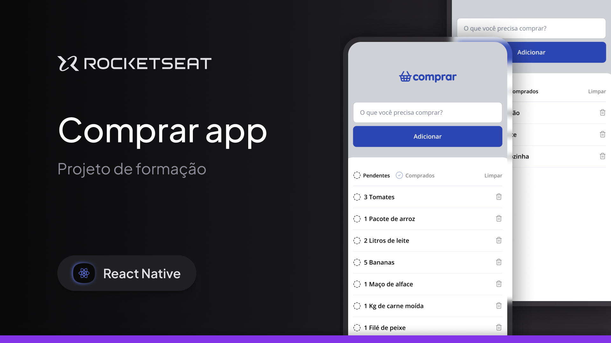
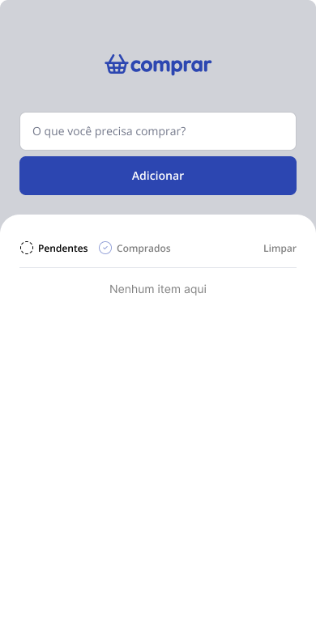
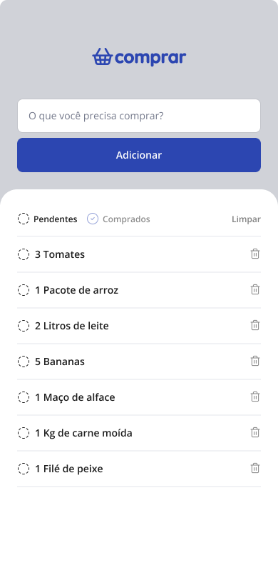
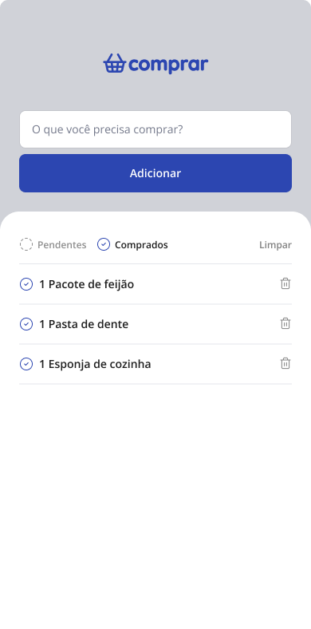

<h1 align="center">
  
</h1>

<p align="center">
  

  

  
  
  <a href="https://github.com/pabloxt14/comprar/commits/master">
    
  </a>
    
   

   <a href="https://github.com/pabloxt14/comprar/stargazers">
    
  </a>
</p>

<p>
  
</p>

<!-- <h4 align="center"> 
	🚀 Aplicação finalizada 🚀
</h4> -->

<p align="center">
 <a href="#-about">About</a> | 
 <a href="#-layout">Layout</a> | 
 <a href="#-setup">Setup</a> | 
 <a href="#-technologies">Technologies</a> | 
 <a href="#-license">License</a>
</p>


## 💻 About

Esta aplicação de nome **comprar** consiste basicamente em um aplicativo mobile de lista de compras com opção de adicionar, remover e marcar como comprado itens de uma lista de compras.

Os principais conhecimentos aplicados nesta aplicação foram os fundamentos em `react-native` e `expo`:
- Criar uma aplicação `react-native` com `expo`
- Criação e estilização de componentes;
- Gerenciamento de estado.


<!-- ## 🔗 Deploy

- Download do APK: [Android](https://github.com/PabloXT14/comprar/releases/download/v1.0.0-beta/comprar-v1.0.0-beta.apk) -->


## 🎨 Layout

Você pode visualizar o layout do projeto através [desse link](https://www.figma.com/community/file/1479824702066313496/comprar-app). É necessário ter conta no [Figma](https://www.figma.com/) para acessá-lo.

A seguir, veja uma demonstração das principais telas da aplicação:

### Home (Empty)

<p align="center">
  
</p>

### Home (Pending)

<p align="center">
  
</p>

### Home (Purchased)

<p align="center">
  
</p>


## ⚙ Setup

### 📝 Requisites

Antes de baixar o projeto você vai precisar ter instalado na sua máquina as seguintes ferramentas:

* [Git](https://git-scm.com)
* [NodeJS](https://nodejs.org/en/)
* [NPM](https://www.npmjs.com/) ou [Yarn](https://yarnpkg.com/)

Além disto é bom ter um editor para trabalhar com o código como [VSCode](https://code.visualstudio.com/)

### Cloning and Running

Passo a passo para clonar e executar a aplicação na sua máquina:

```bash
# Clone este repositório
$ git clone git@github.com:pabloxt14/comprar.git

# Acesse a pasta do projeto no terminal
$ cd comprar

# Instale as dependências
$ npm install

# Gerar o build
$ npx expo prebuild

# Execute a aplicação em modo de desenvolvimento (Expo Go)
$ npm run start

# Execute a aplicação em modo de desenvolvimento (Android)
$ npx expo run:android

# Execute a aplicação em modo de desenvolvimento (iOS)
$ npx expo run:ios
```


## 🛠 Technologies

As seguintes principais ferramentas foram usadas na construção do projeto:

- **[React Native](https://reactnative.dev/)**
- **[Expo](https://expo.dev/)**
- **[TypeScript](https://www.typescriptlang.org/)**
- **[Lucide React Native](https://lucide.dev/guide/packages/lucide-react-native)**
- **[React Native SVG](https://docs.expo.dev/versions/latest/sdk/svg/)**
- **[Async Storage](https://docs.expo.dev/versions/latest/sdk/async-storage/)**

> Para mais detalhes das dependências gerais da aplicação veja o arquivo [package.json](./package.json)


## 📝 License

Este projeto está sob a licença MIT. Consulte o arquivo [LICENSE](./LICENSE) para mais informações

<p align="center">
  Feito com 💜 por Pablo Alan 👋🏽 <a href="https://www.linkedin.com/in/pabloalan/" target="_blank">Entre em contato!</a>  
</p>